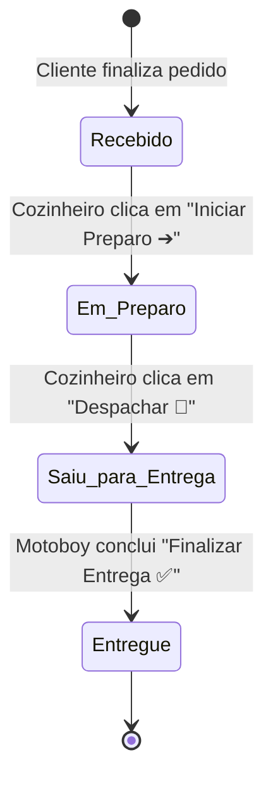

# 🏛️ Arquitetura do Sistema - BurguerSync Ourinhos

O **BurguerSync** adota a **Arquitetura de 3 Camadas (Tri-Layer Pattern)**, garantindo separação estrita entre diretivas de negócio, orquestração e execução determinística.

---

## 📐 Diagrama Arquitetural

```
┌────────────────────────────────────────────────────────────────────────┐
│  Camada 1: Diretivas & Negócio (Layer 1 - SOPs)                        │
│  - /directives/projeto.md (SOP Mestre do Negócio)                      │
│  - /directives/desing/desing.md (Design Tokens e Especificação UI/UX)  │
│  - Regras de negócio (Taxa fixa R$ 5,00, Ponto da Carne, Adicionais)   │
└───────────────────────────────────┬────────────────────────────────────┘
                                    │
                                    ▼
┌────────────────────────────────────────────────────────────────────────┐
│  Camada 2: Orquestração (Layer 2 - Inteligência & Roteamento)          │
│  - Agente Orquestrador (Google Antigravity)                            │
│  - Automação de ciclo de vida e monitoramento de integridade           │
│  - Loop de autorrecuperação (Self-Annealing em .tmp/reports/)          │
│  - Histórico de prompts em /documentation/promptHistory.md             │
└───────────────────────────────────┬────────────────────────────────────┘
                                    │
                                    ▼
┌────────────────────────────────────────────────────────────────────────┐
│  Camada 3: Execução Determinística (Layer 3 - Frontend & SDKs)         │
│  - Frontend Web ESM (HTML5 Semântico, CSS3 Neon Dark Mode)             │
│  - Firebase Firestore SDK Web v10 (Realtime onSnapshot + addDoc)       │
│  - Scripts de automação Node.js (/execution/server.js, test-runner.js) │
│  - Deploy e Sincronização GitHub REST API                              │
└────────────────────────────────────────────────────────────────────────┘
```

---

## 🗄️ Modelo de Dados (Cloud Firestore NoSQL)

### Coleção: `pedidos`

```json
{
  "numeroPedido": 412,
  "horario": "19:42",
  "criadoEm": "2026-09-26T14:50:00.000Z",
  "status": "Recebido",
  "cliente": {
    "nome": "Carlos Eduardo",
    "celular": "(14) 99881-2233",
    "endereco": "Rua Floriano Peixoto, 450 - Centro",
    "obsEntrega": "Apartamento 32"
  },
  "itens": [
    {
      "id": 1,
      "nome": "Ourinhos Smash Burguer",
      "preco": 28.00,
      "quantidade": 1,
      "pontoCarne": "Ao Ponto (Mais Suculento)",
      "adicionaisTexto": "Bacon Crocante Artesanal, Queijo Cheddar Cremoso Extra",
      "remocoesTexto": "Sem Picles",
      "obsItem": "Caprichar no cheddar"
    }
  ],
  "pagamento": {
    "metodo": "Pix",
    "trocoPara": ""
  },
  "valores": {
    "subtotal": 37.50,
    "taxaEntrega": 5.00,
    "total": 42.50
  }
}
```

---

## 🔄 Fluxo de Estados do KDS (Kitchen Display System)


